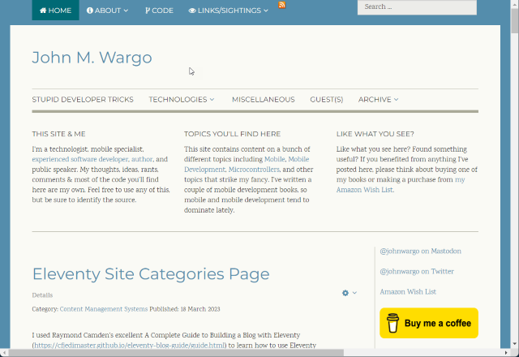

# John Wargo (Eleventy)

The static site generated version of [johnwargo.com](https://johnwargo.com), implemented using [Eleventy](https://www.11ty.dev/).

## Tasks

* [x] Implement core 11ty project
* [x] Minification - https://learneleventyfromscratch.com/lesson/31.html#minifying-html-output
* [x] Publish site on Netlify
* [x] Use jmw-test.com domain
* [x] Get `gen-build-info` working on Netlify
* [x] Categories page with descriptions
* [x] Syntax highlights
* [x] Add image to about page
* [x] Google Analytics
* [x] Fix category links for categories with more than one word
* [x] Select template and implement (Editorial, **Faction**, Future Imperfect)
* [x] Footer
* [x] Export latest Joomla! articles
* [x] Copy post files to project
* [x] Copy image files to project
* [x] Search and replace hhtp:// => https://
* [ ] Clean up exported articles (images, external links)
* [ ] Validate all articles
* [x] Do something with the galleries images (likely kill them)
* [ ] Assign correct style to image files
* [ ] Add post cover image based on category
* [ ] Copy files over
* [ ] Add descriptions to all articles, make page to check
* [ ] Update article lists to use description where its available
* [ ] Run Link Checker
* [ ] Next/Previous Post buttons on Post pages
* [ ] List View pagination, show in-between pages
* [ ] Delete unused images
* [ ] RSS feed and link in menu
* [ ] Sitemap (all pages && posts)
* [ ] Section - Publications (books, articles, etc. from johnwargobooks.com)
* [ ] Section - Code projects (from johnwargo.dev)
* [ ] Section - Related Sites (all of the other sites I maintain)
* [ ] Section - Sightings
* [ ] Add Buy Me a Coffee
* [ ] Algolia Search
* [ ] Statistics page show bar graph of posts/year, and average time between posts
* [ ] Make professional You tube account and move stuff
* [ ] Anchor Links? https://rhianvanesch.com/posts/2021/02/09/adding-heading-anchor-links-to-an-eleventy-site/
* [ ] Newsletter sign up
* [ ] Automatically tweet and mastodon new posts?
* [ ] Discussions

https://www.favicon-generator.org/

{target="_blank"}


