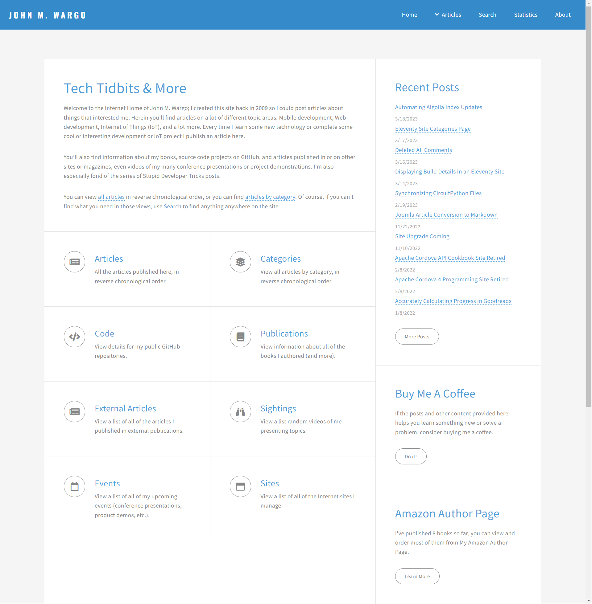

# John Wargo (Eleventy)

The static site generated version of [johnwargo.com](https://johnwargo.com), implemented using [Eleventy](https://www.11ty.dev/) hosted on [GitHub](https://github.com/johnwargo/johnwargo-static-11ty).

## The Site at Launch

## Previous version

## Notes to Self

https://pixelarity.com/faction
https://www.favicon-generator.org/

{target="_blank"}


