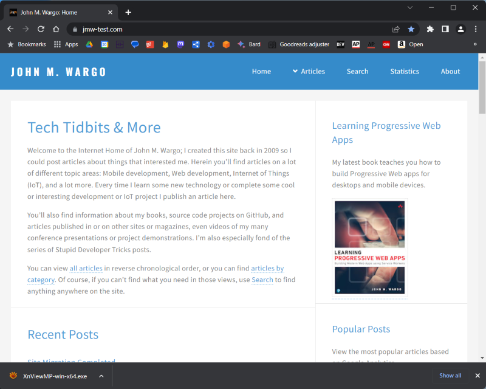
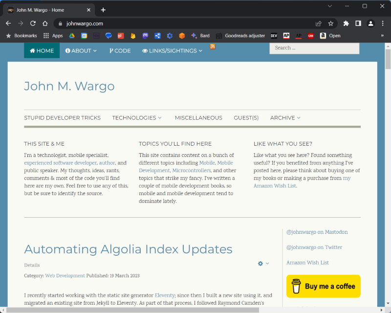

# John Wargo (Eleventy)

[](https://app.netlify.com/sites/johnwargo/deploys)

The static site generated version of [johnwargo.com](https://johnwargo.com), implemented using [Eleventy](https://www.11ty.dev/) hosted on [GitHub](https://github.com/johnwargo/johnwargo-static-11ty).

[Task List](https://trello.com/b/eoqh8Fte/jmw-site-tasks)

- [ ] Swap out image library for internal support: https://www.aleksandrhovhannisyan.com/blog/eleventy-image-transform/
- [ ] Implement Fetch plugin
- [ ] Fix Google analytics stats, they seem off

## The Site at Launch



## Previous version



## Resources I Used

The following list is a likely incomplete list of all of the resources I used to migrate this site from Joomla! to Eleventy:

* [Raymond Camden: A Guide to Building a Blog in Eleventy](https://www.raymondcamden.com/2022/01/19/a-guide-to-building-a-blog-in-eleventy)
* [Raymond Camden: Adding Algolia Search to Eleventy and Netlify](https://www.raymondcamden.com/2020/06/24/adding-algolia-search-to-eleventy-and-netlify)
* [Organizing the Eleventy config file](https://www.lenesaile.com/en/blog/organizing-the-eleventy-config-file/)
* [target="_blank" links in markdown](https://github.com/11ty/eleventy/issues/2301)
* [HTML Transforms](https://learneleventyfromscratch.com/lesson/31.html#minifying-html-output)
* [Minimizing HTML Output](https://learneleventyfromscratch.com/lesson/31.html#minifying-html-output)
* [Using the New Google Analytics API to Get Most Popular Pages](https://fjolt.com/article/javascript-ga-api-most-popular-posts)
* []()
* []()

The following lists the tools I created to help me better migrate the site from Joomla! and manage the site going forward. There should be a blog post here for each of these tools. As soon, of course, as I write them.

* [Joomla! to Markdown](https://www.npmjs.com/package/joomla-to-markdown)
* [Eleventy Category Pages](https://www.npmjs.com/package/eleventy-category-pages)
* [Generate Build Info](https://www.npmjs.com/package/generate-build-info)
* [Eleventy New Post](https://www.npmjs.com/package/eleventy-new-post)
* [Algolia Index Update](https://www.npmjs.com/package/algolia-index-update)
* [YAML Add Property](https://www.npmjs.com/package/yaml-add-property)

Here are some tools I used to help me manage and/or create the site.

* [TinyPNG](https://tinypng.com/)
* [pack11ty](https://github.com/nhoizey/pack11ty)
* []()

## Notes to Self

Header image: 1980 x 400

Site Template: [Pixelarity: Faction](https://pixelarity.com/faction)
FavIcon Generator: [Favicon.ico & App Icon Generator](https://www.favicon-generator.org/)

How to make a markdown link open in a new tab: 

```markdown
[](){target="_blank"}
```

This only works if you follow the instructions in [target="_blank" links in markdown](https://github.com/11ty/eleventy/issues/2301).

### How to hide Liquid, From, Well Liquid

Use the following codes to show Liquid template language in a post

```liquid



```
### Debug Mode

```shell
set DEBUG=Eleventy* & npx @11ty/eleventy
```

### Image Shortcode

```liquid

```

### Publications record

```json
,{
  "title": "",
  "date": "",
  "url": "",
  "description": ""
},
```

### Events record

```json
, {
  "title": "",
  "date": "",
  "url": "",
  "description": ""
}
```

***

You can find information on many different topics on my [personal blog](https://www.johnwargo.com). Learn about all of my publications at [John Wargo Books](https://www.johnwargobooks.com).

If you find this code useful and feel like thanking me for providing it, please consider <a href="https://buymeacoffee.com/johnwargo" target="_blank">Buying Me a Coffee</a>, or making a purchase from [my Amazon Wish List](https://amzn.com/w/1WI6AAUKPT5P9).
